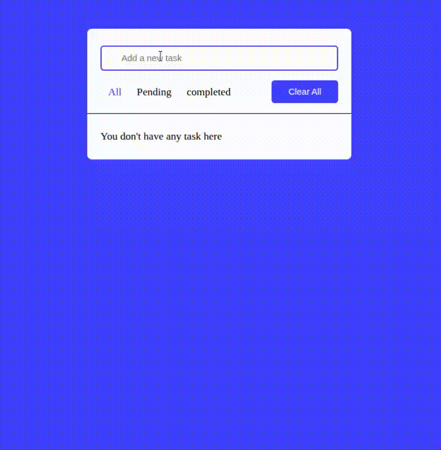

# 📝 Todo App

A simple **Todo Application** built with **vanilla JavaScript**, HTML, and CSS.  
This project was my **first JavaScript project**, created to practice DOM manipulation, event handling, and basic CRUD operations.

---

## 🚀 Features

- ➕ Add new tasks
- ✏️ Edit existing tasks
- ✅ Mark tasks as completed (with strikethrough style)
- ❌ Delete individual tasks
- 🗑️ Clear all tasks at once
- 🔍 Filter tasks by:
  - All
  - Pending
  - Completed
- Responsive and minimal UI

---

## 🛠️ Technologies Used

- **HTML5** – Structure
- **CSS3** – Styling and layout
- **Vanilla JavaScript (ES6)** – Logic and interactivity
- **Font Awesome** – Icons

---

## 🚀 How to Run

1. Clone the repo:
   ```bash
   git clone https://github.com/SadafAmiiniii/todo-app.git
   cd chats
2. Open the project folder:
      ```bash
      cd todo-app
3. Run the app by opening index.html in your browser

---

## 🔍 Improvements & Best Practices  

- Use **local storage** to persist tasks even after refreshing the page  
- Replace inline `onclick` handlers with `addEventListener`  
- Add animations for adding/removing tasks 

---

## 📸 Preview



---


